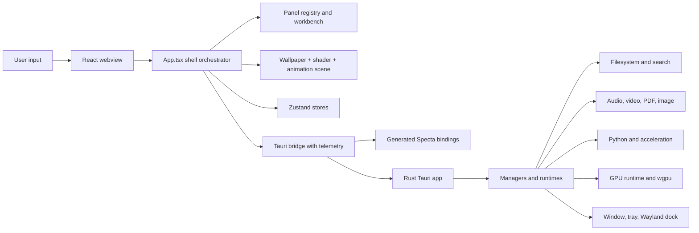
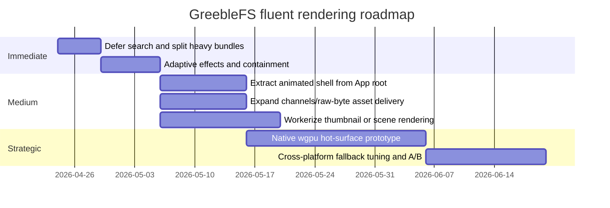

# GreebleFS Rendering Performance Research Report

## Executive summary

Enabled connectors used at the start of this research: **GitHub**. The repository accessible through that connector shows **GreebleFS** as a desktop workbench built on **React 19 + Vite 7 + Bun** in the frontend and **Tauri 2 + Rust** in the desktop layer, with a very large native surface area that includes filesystem, global search, cloud, audio, video, PDF, Python, GPU runtime, and theme/rendering subsystems. The codebase already contains several unusually strong performance foundations: generated typed Tauri bindings via Specta, a telemetry-wrapped bridge, raw byte fast-path IPC for preview data, worker-based frontend offload for module transpilation, xterm WebGL probing with software fallback, and a built-in **120 FPS** overlay telemetry target plus automated frame-probe scripts. fileciteturn44file0 fileciteturn51file0 fileciteturn53file0 fileciteturn46file0 fileciteturn38file0 fileciteturn41file0 fileciteturn42file0 fileciteturn43file0

The main performance risk is therefore **not missing infrastructure**. It is that the current UI architecture asks the browser compositor and React main thread to do too much at once. The main `App.tsx` is a giant orchestration surface that owns overlay animation state, command palette state, layout, themes, wallpapers, shaders, animations, plugin/theme packages, mobile-share state, global search plumbing, window routing, and panel composition. On top of that, the visible shell stacks a **transparent undecorated window**, full-shell blur/backdrop-filter, wallpaper, shader layers, theme visuals, border shader, animation overlay, and then the workbench body. On Windows and Linux in particular, that combination is exactly the kind of workload that can look beautiful at rest and become janky under interaction, resize, scroll, or panel churn. fileciteturn50file0 fileciteturn52file0 citeturn0search1turn0search2turn0search3

My bottom-line recommendation is to treat GreebleFS as a **tiered renderer**. Keep React for orchestration, navigation, and low-frequency UI state; keep the webview for most panels; but aggressively isolate frame-driven animation from the giant root component, reduce compositing and blur pressure by default, lazy-load heavy panel bundles, defer search/update work with React concurrency primitives, and use channels/asset-style delivery for heavier byte flows. If, after those changes, the decorative scene or hot-path previews still cap out the webview, then the right next step is **native Rust `wgpu` for the hottest surfaces only**, not a whole-app rewrite. That is the highest-ceiling path while preserving cross-platform reach. fileciteturn50file0 fileciteturn53file0 fileciteturn55file0 citeturn5view0turn5view1turn12search4turn12search0

The important caveat is that **120 FPS everywhere** is not a realistic universal default when the shell combines transparency, blur, live shaders, animation overlays, and platform-specific windowing tricks across WebView2, WKWebView/WebKit, and Linux webviews/compositors. What is realistic is this: **stable 60 FPS across all three desktop OSes** as the baseline, and **100–120 FPS** for core shell motion, pointer interaction, and scrolling on stronger hardware once expensive effects are adaptively gated. That conclusion follows both from the browser rendering model and from the repo’s own explicit 120 FPS telemetry ambition. fileciteturn41file0 citeturn0search2turn6search2turn6search0

## Repository findings

At a high level, GreebleFS is a **multi-window desktop workbench**. The frontend bootstrap chooses between the main shell, a file-operations window, and an explorer-picker window based on the current Tauri window label. It installs global error handlers, initializes managed content directories, and then mounts the chosen React root. fileciteturn45file0



The repo’s architectural center of gravity is `src/App.tsx`, and that matters for performance because it is not just a page component. It is effectively a **UI kernel**. It manages overlay open/close state, animation progress, Linux display-server routing, Wayland dock handoff, blur/zoom/transparency controls, authored theme assets, theme packages, icon themes, home/menu packs, command palette state, global search integration, mobile-share state, panel layout state, pinned panels, active panels, and the shell’s rendering scene. That means every frame-driven or high-frequency state path that remains inside this component has a chance to invalidate a very large subtree. fileciteturn50file0

The rendering pipeline is visually rich but expensive. The root shell composes, in order, an optional wallpaper background, optional theme effect background image, a background shader layer, theme visuals, a border shader layer, an animation overlay layer, and then the shell body itself. The shell body also uses transparent or translucent backgrounds, conditional blur filters, rounded borders, scaling transforms, and top-bar shader effects. On the Tauri side, the default window configuration is **transparent**, **undecorated**, **invisible at launch**, **always-on-top**, and **skipTaskbar**, which is exactly the sort of native-window setup that can amplify compositor costs when large translucent regions repaint. fileciteturn50file0 fileciteturn52file0

Asset loading is flexible but broad. The app initializes managed content directories, scans directories for authored wallpapers, animations, shaders, icon themes, top bars, home packs, menu packs, and theme packages, reads text assets through Tauri commands, and reloads them via polling intervals when live reload is active and the overlay is visible. This is a good authoring workflow, but it also means the shell can accumulate a lot of asset-management work around the same time it is trying to animate or respond to input. In production this is less harmful, because the polling gates depend on developer mode and visibility, but in development it can absolutely distort your frame results. fileciteturn45file0 fileciteturn50file0

The Tauri/Rust bridge is one of the stronger parts of the repo. `src/runtime/tauriClient.ts` wraps generated Specta bindings and instruments command/event usage with frontend telemetry. More importantly, the native `lib.rs` adds **raw IPC handlers** for `fs_read_preview_bytes`, `cloud_read_preview_bytes`, and `global_search_query_under_path`, so those paths can bypass ordinary JSON command payload overhead and move bytes more directly. That is already the right instinct for fluent rendering. It is also evidence that GreebleFS is ready for more aggressive binary/streaming transport on other hot paths if needed. fileciteturn53file0 fileciteturn55file0

The Rust side is broad and capable. The crate manifest includes `tauri` with tray/macos-private-api/specta features, a large set of Tauri plugins, Yazi-derived explorer crates, `wgpu`, audio/video/PDF/image stacks, search/indexing dependencies, and multiple platform-specific integrations. During setup, the app registers managers for terminal, cloud, audio engine, GPU runtime, image editor, PDF preview, Python sidecar, video engine, VST host runtime, telemetry, entry-size cache, and plugin watching, and it initializes the Wayland dock host where relevant. In other words, the backend is not a thin shim; it is a serious native runtime. fileciteturn51file0 fileciteturn55file0 fileciteturn54file0

A few repo details are especially relevant to performance strategy. First, the app explicitly targets **120 FPS** in `frameTelemetry.ts`, and the repo already includes a browser-only probe script and a Tauri desktop probe script that persist frame data for automation. Second, the frontend already offloads runtime-module transpilation to a worker lane with a local fallback. Third, the terminal stack already probes WebGL2 support and avoids the xterm WebGL renderer on software renderers such as llvmpipe or SwiftShader. Those are all signs that the codebase is performance-aware and can support an adaptive-quality model cleanly. fileciteturn41file0 fileciteturn42file0 fileciteturn43file0 fileciteturn46file0 fileciteturn38file0 citeturn12search1

The build surface is also larger than it first appears. The package manifest shows heavyweight frontend dependencies including Monaco, Fabric, Three, HyperFormula, jsPDF, Mammoth, XLSX, Framer Motion, Glide Data Grid, xterm and its WebGL addon. That combination is powerful, but it is also a warning that **startup parse/compile/initialization pressure** can be significant if those modules land in early chunks or are imported through broad panel registries up front. fileciteturn44file0 fileciteturn50file0

## Optimization priorities

The highest-priority change is to **move frame-driven animation state out of the giant `App` component**. Right now the shell’s open/close path updates `animationProgress` on every `requestAnimationFrame`, and `requestAnimationFrame` callbacks are scheduled in lockstep with the display refresh rate, including 120 Hz and 144 Hz displays. In practice, that means the repo can accidentally turn a decorative shell animation into a **120-Hz full-root rerender problem**. The fix is not “more memoization everywhere.” The fix is to isolate animated scene state in a much smaller component, or use CSS/Web Animations API for the shell transform/opacity path, leaving React to update only the control plane. This is the single highest-value structural change. Effort: **medium**. Trade-off: a moderate refactor of shell composition, but low long-term maintenance risk. fileciteturn50file0 citeturn6search2turn0search2

The next highest-priority change is to **reduce full-window compositor pressure**, especially from large blurred/translucent surfaces. Browser guidance remains consistent here: the cheapest path is compositor-only changes, especially `transform` and `opacity`; layout-affecting or paint-heavy properties are much more expensive; and `will-change` should only be applied sparingly and temporarily. GreebleFS currently combines full-shell blur/backdrop, wallpaper, shader layers, theme visuals, and animation overlays in one window. My recommendation is to define scene-quality tiers: on Linux, default to a reduced-effects mode; on Windows, automatically downgrade full-window blur or shader borders under frame pressure; on macOS, keep richer effects available, but still gate them by telemetry. Effort: **low to medium**. Trade-off: less visual richness at the bottom end, much better consistency at the median. fileciteturn50file0 fileciteturn52file0 citeturn0search1turn0search2turn0search3turn6search0

The third priority is to **shrink startup and interaction cost by splitting heavy bundles and lazy-loading panel code**. The dependency set strongly suggests that a number of panels or tools are expensive enough that they should not be in the first wave of JS parse and compile unless the user opens them. This matters for first interactive paint, shell open latency, and command-palette responsiveness. The repo’s current shape makes this especially important because the main shell imports and orchestrates a large ecosystem of panels and themes. Effort: **low** for chunking, **medium** for panel-level lazy boundaries. Trade-off: slightly more bundle complexity and a few loading boundaries, in exchange for a faster shell and less main-thread competition. fileciteturn44file0 fileciteturn50file0 citeturn0search2turn11search0

The fourth priority is to **use React concurrency where the repo is currently doing expensive synchronous-ish UI work**. The clearest immediate win is the command palette/global search path: the app stores `commandPaletteQuery` in `App.tsx` and then pushes it into the global-search subsystem. That is exactly the kind of “keep typing fluid while results catch up” workload that `useDeferredValue` and, where appropriate, `useTransition` were designed for. Use them for search, broad settings recalculation surfaces, and other non-urgent updates. Do **not** use them as your main fix for frame-by-frame animation; that should leave React entirely or nearly entirely. Effort: **low**. Trade-off: slightly more mental overhead around stale/deferred UI states, but large gains in perceived responsiveness. fileciteturn50file0 citeturn0search0turn0search8

The fifth priority is to **push more hot rendering work off the main thread** where the browser platform reliably allows it. `OffscreenCanvas` is now broadly available and transferable, and it can run in workers. That makes it a strong candidate for thumbnail generation, decorative shader passes that do not need DOM access, and any canvas-heavy rendering that currently competes with pointer/input/layout work on the main thread. This is especially relevant because GreebleFS already renders 3D thumbnails with Three.js and already serializes those renders through a shared queue; that is a perfect future candidate for worker/offscreen migration or a native Rust path. Effort: **medium**. Trade-off: more orchestration complexity and browser-compatibility testing. fileciteturn47file0 fileciteturn48file0 citeturn1search0turn1search1

The sixth priority is to **expand the repo’s existing fast-path IPC strategy**. Tauri’s own docs are explicit: events are simple and global, but not designed for low-latency or high-throughput use; channels are the fast ordered mechanism recommended for streaming data to the frontend. The repo already uses raw byte handlers for preview and global-search flows, which is the right pattern. I would extend that philosophy to any future terminal-output bursts, image/video preview streams, or large result sets that still cross JSON-heavy boundaries. For local media and asset-heavy surfaces, the safer choice is usually the default custom/asset protocol rather than the localhost plugin, because Tauri documents the localhost route as carrying substantial security risk. Effort: **medium**. Trade-off: more native/frontend protocol code, but a cleaner boundary for high-volume data. fileciteturn53file0 fileciteturn55file0 citeturn5view0turn5view1turn14search1turn14search4

The seventh priority is the **strategic high-ceiling option**: use **native Rust `wgpu`** for the hottest visual paths if the webview remains the bottleneck after the lower-cost changes. This repo already depends on `wgpu`, so the native side is capable of owning that evolution. My recommendation is not to move the whole UI there. Instead, prototype it for one of three things only: the decorative shell scene, live heavy preview surfaces, or a dedicated viewport panel. That lets React remain the orchestrator while the Rust side handles a frame-critical surface natively. Effort: **high**. Trade-off: significantly more code, more platform integration, and more testing burden, but also the highest performance ceiling. By contrast, **WebGPU inside the webview** is interesting but should not be your universal baseline today because it remains uneven in browser availability. fileciteturn51file0 citeturn12search4turn12search0

A concise decision table follows.

| Option | Expected gain | Complexity | Cross-platform safety | Maintenance burden |
|---|---:|---:|---:|---:|
| Adaptive effects and compositor cleanup | High | Low | Excellent | Low |
| Extract animation state from `App` | Very high | Medium | Excellent | Low |
| Deferred search and React concurrency | Medium | Low | Excellent | Low |
| Bundle splitting and lazy panels | Medium | Low-Medium | Excellent | Low |
| OffscreenCanvas worker rendering | High on canvas-heavy paths | Medium | Good | Medium |
| Channels/raw bytes/asset protocol | Medium-High | Medium | Excellent | Medium |
| WebGPU in webview | High where available | High | Uneven | Medium-High |
| Native Rust `wgpu` for hot surfaces | Highest ceiling | Very high | Excellent | High |

## Concrete patches

The first patch I would land immediately is to **defer command-palette search work** so typing stays fluid while results catch up. That is low-risk, highly local, and exactly aligned with React’s intended use of deferred values for non-urgent UI updates. fileciteturn50file0 citeturn0search0

```diff
diff --git a/src/App.tsx b/src/App.tsx
index aa1cfa6..localpatch 100644
--- a/src/App.tsx
+++ b/src/App.tsx
@@
-import { useState, useEffect, useRef, useCallback, useMemo, type CSSProperties } from 'react';
+import {
+  useState,
+  useEffect,
+  useRef,
+  useCallback,
+  useMemo,
+  useDeferredValue,
+  type CSSProperties,
+} from 'react';

@@
   const [pendingRepositoryImports, setPendingRepositoryImports] = useState<string[]>([]);
   const [commandPaletteQuery, setCommandPaletteQuery] = useState('');
+  const deferredCommandPaletteQuery = useDeferredValue(commandPaletteQuery);

@@
   useEffect(() => {
     if (!isCommandPaletteOpen) {
       return;
     }

-    setGlobalSearchQuery(commandPaletteQuery, globalSearchPriorityPaths);
+    setGlobalSearchQuery(deferredCommandPaletteQuery, globalSearchPriorityPaths);
   }, [
-    commandPaletteQuery,
+    deferredCommandPaletteQuery,
     globalSearchPriorityPaths,
     isCommandPaletteOpen,
     setGlobalSearchQuery,
   ]);
```

The second patch is to **make visual richness adaptive instead of fixed**, and to add **CSS containment/isolation** to panel surfaces so the shell pays less reflow/paint tax when rich effects are active. This is particularly important because the current scene stacks blur, wallpaper, top-level shaders, animation overlays, and translucent shells in one root, and your own telemetry already gives you the signal you need to degrade gracefully under pressure. fileciteturn50file0 fileciteturn41file0 citeturn0search1turn0search2turn0search3turn6search0

```diff
diff --git a/src/App.tsx b/src/App.tsx
index aa1cfa6..localpatch 100644
--- a/src/App.tsx
+++ b/src/App.tsx
@@
   const shellBackdropFilter = resolveConditionalBlurFilter({
-    enabled: appBlur,
-    blurPx: clampedAppBlurStrength,
-    saturateBoost: 0.35,
+    enabled: appBlur && !effectsDowngraded,
+    blurPx: effectsDowngraded ? 0 : clampedAppBlurStrength,
+    saturateBoost: effectsDowngraded ? 0 : 0.35,
   });

+  const effectsDowngraded =
+    runtimePlatform === 'linux'
+    || (latestOverlayFrameStats != null
+      && latestOverlayFrameStats.p95FrameMs > (1000 / 60));

@@
 function LayoutPinnedPanelSlot({
   panel,
   definition,
 }: {
@@
     <div
       style={{
+        contain: 'layout paint style',
+        isolation: 'isolate',
         flexBasis: panel.size,
         width: panel.size,
         minWidth: panel.size,
@@
   const renderManagedPanelSurface = useCallback((
     panelId: string,
@@
         style={{
+          contain: 'layout paint style',
+          isolation: 'isolate',
           flex: 1,
           width: '100%',
           height: '100%',
@@
-            <ShaderSurfaceLayer
-              shader={activeShader}
-              shellContext={shellShaderContext}
-              surface="background"
-            />
+            {!effectsDowngraded ? (
+              <ShaderSurfaceLayer
+                shader={activeShader}
+                shellContext={shellShaderContext}
+                surface="background"
+              />
+            ) : null}

@@
-            <ShaderSurfaceLayer
-              shader={activeShader}
-              shellContext={shellShaderContext}
-              surface="border"
-            />
+            {!effectsDowngraded ? (
+              <ShaderSurfaceLayer
+                shader={activeShader}
+                shellContext={shellShaderContext}
+                surface="border"
+              />
+            ) : null}
```

The third patch is to **split heavy frontend dependencies into explicit Vite chunks**. The dependency manifest shows multiple libraries that are expensive enough to deserve isolation. This is one of the fastest ways to reduce parse/compile pressure and make the shell feel lighter before you even touch runtime rendering. fileciteturn44file0 citeturn0search2turn11search0

```diff
diff --git a/vite.config.ts b/vite.config.ts
index current..localpatch 100644
--- a/vite.config.ts
+++ b/vite.config.ts
@@
 export default defineConfig({
   plugins: [
     react(),
     tailwindcss(),
   ],
+  build: {
+    sourcemap: true,
+    rollupOptions: {
+      output: {
+        manualChunks: {
+          xterm: [
+            '@xterm/xterm',
+            '@xterm/addon-fit',
+            '@xterm/addon-web-links',
+            '@xterm/addon-webgl',
+          ],
+          monaco: ['@monaco-editor/react'],
+          three: ['three'],
+          canvas: ['fabric'],
+          dataTools: ['hyperformula', 'xlsx', 'jspdf', 'mammoth'],
+        },
+      },
+    },
+  },
 });
```

A fourth, slightly larger refactor should follow soon after those three: **extract shell animation progress out of `App.tsx`**. The exact implementation can vary, but the design goal should be fixed: a small `AnimatedSceneHost` owns per-frame progress, while a memoized `WorkbenchShell` receives only low-frequency props. That directly breaks the current linkage between rAF-driven visual progress and a huge React root. fileciteturn50file0 citeturn6search2

## Profiling and benchmarking

The repo already gives you the right starting point: it has a **120 FPS target**, it records `overlay_frame_time` with a p95-style summary window, and it includes two automation scripts that probe the browser shell and the Tauri shell separately. Use those first, because they are tightly aligned with how GreebleFS already thinks about performance. fileciteturn41file0 fileciteturn42file0 fileciteturn43file0

```bash
# cross-platform repo baselines
bun install

# browser-only UI probe
node scripts/run-overlayterm-frame-probe.mjs

# desktop Tauri probe
node scripts/run-overlayterm-tauri-frame-probe.mjs
```

The browser probe spins up a Vite server and Playwright/Chromium, drives the shell through viewport changes and scroll input, then reads the latest `overlay_frame_time` sample and writes evidence files. The desktop probe does the same through the Tauri app and waits for the probe JSON written by the app. These should become required gates in CI once you stabilize the thresholds. fileciteturn42file0 fileciteturn43file0

For **Windows**, use three layers of tooling. First, use the built-in browser tooling exposed by the underlying Chromium/WebView2 stack: Chrome DevTools Performance panel, the real-time FPS meter, paint flashing, and layer borders. Second, use **WPR/WPA** for whole-system ETW capture. Third, use **GPUView** when you specifically need compositor/GPU queue diagnosis. Microsoft’s documentation places WPR/WPA in the Windows Performance Toolkit and GPUView in the ADK/WPT stack. citeturn11search0turn11search1turn11search2turn11search3turn7search3turn7search0turn7search1turn7search4

```powershell
# run GreebleFS normally, then in an elevated shell:
wpr -start GeneralProfile -filemode

# reproduce: open overlay, scroll explorer, spam terminal output, resize, switch modes

wpr -stop greeblefs.etl
```

In WPA, inspect CPU saturation, long main-thread tasks, and GPU/compositor alignment around overlay open/close, resize, explorer scroll, and terminal bursts. If you still suspect presentation/compositor stalls, capture a GPUView trace through the WPT/GPUView tooling and look for queue bubbles or present delays. citeturn7search0turn7search1turn7search4

For **macOS**, profile on a real device-class machine, not just on the simulator. Apple’s guidance is explicit that higher-fidelity performance measurements come from real devices, and that **Time Profiler** is the first tool for UI unresponsiveness and hangs. Use Time Profiler first, then add Core Animation / Metal-oriented traces if you introduce heavier native graphics work. Energy Log is also worth a pass because transparent/blur-heavy shells can look acceptable while still being too power-hungry. citeturn8search0turn8search2turn8search4

```bash
# list installed Instruments templates
xcrun xctrace list templates

# example CPU profile run
xcrun xctrace record \
  --template "Time Profiler" \
  --launch /Applications/GreebleFS.app \
  --output greeblefs-time.trace
```

For **Linux**, combine an app-local CPU profile with a whole-system profile. `perf stat` is good for quick counter baselines, `perf record` is good for call stacks, and **Sysprof** is especially useful because it is a whole-system profiler that can show both hot functions and main-loop slowdowns. GNOME’s Sysprof docs explicitly call out main-loop stalls and note that stack unwinding is best with frame pointers available. citeturn9search0turn9search1turn9search6turn10search0

```bash
# quick counter baseline
perf stat -d -r 5 -- ./src-tauri/target/release/greeblefs

# call-stack capture
perf record -g --call-graph dwarf -- ./src-tauri/target/release/greeblefs
perf report
```

For **frontend instrumentation inside the repo**, extend the existing telemetry observer installation with a `PerformanceObserver` for long tasks. MDN documents `PerformanceObserver` as widely available and `PerformanceLongTaskTiming` as the source of entries for tasks that block the main thread for **50 ms or more**. That is a very good complement to your frame-time telemetry because it pinpoints exactly when “feels bad” input episodes occur even if average FPS still looks passable. citeturn13search1turn13search0

```ts
// add inside installFrontendTelemetryObservers()
const longTaskObserver = new PerformanceObserver((list) => {
  for (const entry of list.getEntries()) {
    recordFrontendTelemetry({
      layer: 'browser',
      kind: 'longtask',
      name: 'main-thread-block',
      status: 'ok',
      metadata: {
        durationMs: entry.duration,
        startTime: entry.startTime,
      },
    });
  }
});

if (PerformanceObserver.supportedEntryTypes?.includes('longtask')) {
  longTaskObserver.observe({ type: 'longtask', buffered: true });
}
```

The benchmark matrix I would actually run on each OS is short and strict: **cold boot to first usable shell**, **overlay open**, **overlay close**, **explorer scroll**, **terminal output burst**, **window resize/drag**, **command palette typing**, and **theme/wallpaper/shader swap**. Track p95 frame time, worst frame time, long-task count, CPU package/core usage, GPU activity, and end-to-end latency from input to next paint. If you cannot keep those journeys stable with effects enabled, the fix is usually not “optimize everything”; it is to reduce the active visual tier during that journey. fileciteturn41file0 citeturn11search0turn11search1turn13search0

## Roadmap, option comparison, sources, and limitations

The best implementation sequence is to start with the cheap structural wins, then move to worker/transport refactors, and only then prototype native rendering for the hottest surfaces.



The risk-managed roadmap is straightforward. In the **immediate phase**, land deferred search, bundle splitting, adaptive effects, and containment. In the **medium phase**, isolate animation from the root component and move more heavy data/render work off the main thread or off JSON IPC. In the **strategic phase**, prototype native `wgpu` on a single hot surface and compare it directly against the improved webview path before committing further. The key risk mitigation is to keep every step behind either a performance tier or a feature flag, so you can A/B on Windows, macOS, and Linux rather than betting the whole shell on one rendering strategy. fileciteturn50file0 fileciteturn51file0 citeturn12search0turn12search4turn5view0turn5view1

A final comparison table helps frame the migration choice space.

| Path | Best use | Performance upside | Main risk |
|---|---|---:|---|
| Clean up current webview scene | Baseline shell fluency | High | Some visual downgrade |
| Split animation from React root | Open/close, resize, shell motion | Very high | Medium refactor |
| Channels/raw bytes/asset URLs | Media/search/preview transport | Medium-High | More bridge code |
| OffscreenCanvas workers | Canvas and thumbnail paths | High | Worker orchestration |
| WebGPU in webview | Experiments on capable stacks | High | Uneven browser support |
| Native Rust `wgpu` surface | Hottest visual/viewer paths | Highest | Highest implementation cost |

The prioritized source set for this report is, in order of actionability: the repo’s own frame telemetry and probe scripts; the main shell file; the typed Tauri bridge and native raw-invoke handlers; Tauri’s channels/event documentation; React’s `useDeferredValue` and `useTransition`; MDN’s `requestAnimationFrame`, `OffscreenCanvas`, `content-visibility`, `contain-intrinsic-size`, `will-change`, and WebGPU docs; Chrome DevTools runtime/rendering docs; and the platform-native profilers from Microsoft, Apple, GNOME, and Linux perf. fileciteturn41file0 fileciteturn42file0 fileciteturn43file0 fileciteturn50file0 fileciteturn53file0 fileciteturn55file0 citeturn5view0turn5view1turn0search0turn0search8turn6search2turn1search1turn1search2turn1search4turn6search0turn12search0turn11search0turn11search1turn7search3turn7search1turn8search0turn8search2turn10search0turn9search0turn9search1

The main limitation of this report is that it is based on **repository inspection and external primary documentation**, not on live traces captured from your exact machines. I did not inspect every panel implementation in depth, and some recommendations are necessarily inferred from the architectural center of gravity and the visible rendering stack rather than from a full flame graph of every subsystem. That said, the highest-confidence findings are very strong: GreebleFS already has the right telemetry, the right native capabilities, and the right fast-path instincts; the next gains are mostly about **reducing main-thread invalidation and compositor cost in the shell you already have**.